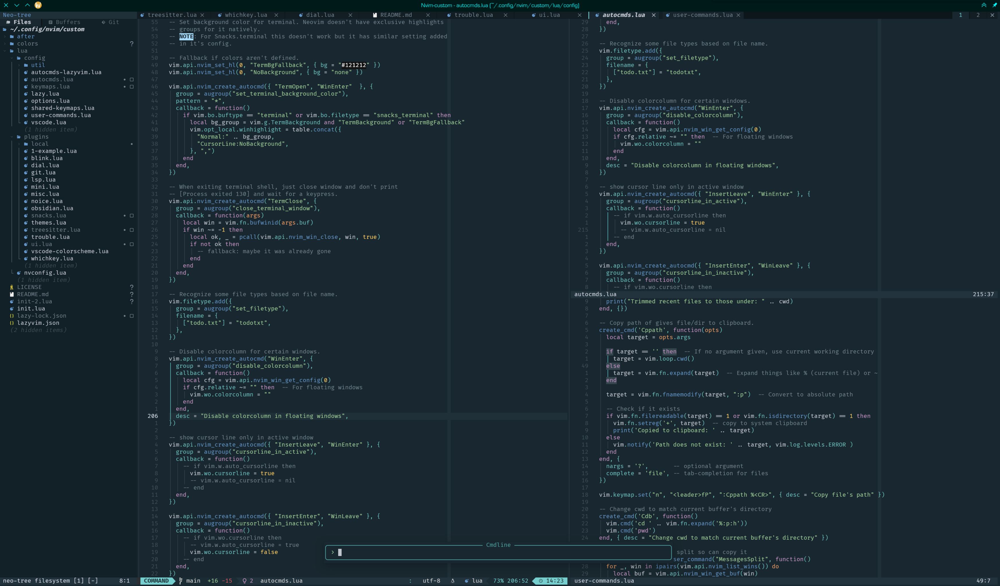

# My Neovim configuration

This is my Neovim configuration. It uses [Lazy.nvim](https://github.com/folke/lazy.nvim) as plugin manager. Part of the plugin
configurations are from [LazyVim](https://www.lazyvim.org) since . I have mentioned this in comments. LazyVim isn't used as distribution. 

## Features

General
- Compatible with VSCode when using VSCode Neovim -extension.
- Plugins are lazy loaded if possible to keep startup speed fast.

Configurations for
- Key mappings
- Neovim options

Autocommands which are code executed at certain events:
- Config hot reloading
- Custom terminal background color.
- Neovim CLI option to select session during startup.
- Dynamic window titles based on used config or session.
- Command mode aliases.
- Change Obsidian.nvim vault automatically based on working directory.

User commands
- Change part of dynamic window title.
- Clear oldfiles.
- Copy file path to clipboard.
- Open messages in new split.
- Reload settings.
- Trim trailing whitespace.

Plugins:
- Treesitter code parsing for better syntax highlighting, code folding and text objects.
- Language Server Protocol for linting code completion using Blink autocompletion.
- Snacks provide lot of quality of life improvements. Snacks.picker is used as picker.
- Mini.nvim
- UI: BufferLine, Lualine, Neotree, Trouble.
- NvChad's Base46 oceanic-next theme.
- Obsidian.nvim, Dial, Noice.
- And many more.

## File Structure

    nvim/
    ├── lua
    │   ├── config
    │   │   ├── util                  - Utility functions.
    │   │   ├── autocmds.lua          - Custom autocommands.
    │   │   ├── autocmds-lazyvim.lua  - LazyVim autocommands.
    │   │   ├── keymaps.lua           - Key mappings for this config.
    │   │   ├── shared-keymaps.lua    - Key mappings shared between different Neovim configs.
    │   │   ├── lazy.lua              - Lazy.nvim plugin manager settings.
    │   │   ├── options.lua           - Neovim options.
    │   │   ├── user-commands.lua     - User commands used in command mode.
    │   │   └── vscode.lua            - Settings used only when running embedded to VSCode.
    │   ├── nvconfig.lua              - Config used for base46 theme plugin.
    │   └── plugins                   - Lazy.nvim plugin specifications.
    │       ├── local                 - Local custom plugins.
    │       │   ├── spec1.lua
    │       │   ├── **
    │       │   ├── spec2.lua
    │       ├── spec1.lua
    │       ├── **
    │       └── spec2.lua
    └── init.lua                      - Bootstrapping configuration.

 ## Requirements

    Neovim >= 0.11.2 (needs to be built with LuaJIT)
    Git >= 2.19.0 (for partial clones support)
    a Nerd Font(v3.0 or greater) (optional, but needed to display some icons)
    tree-sitter-cli and a C compiler for nvim-treesitter.
    curl for blink.cmp (completion engine)
    live grep: ripgrep
    find files: fd
    a terminal or Neovim GUI that support true color and undercurl:
        Neovide
        Konsole / Yakuake ≥ 22.04 (Linux)
        kitty (Linux & Macos)
        alacritty, wezterm, ghostty (Linux, Macos & Windows)
        iterm2 (Macos)

## License

This configuration is a combination of:
- code derived from the LazyVim project
- my own original configuration

### LazyVim-derived parts

Portions of configurations are based on the LazyVim project, which is licensed under the Apache License 2.0. 
Copyright © LazyVim contributors

Those parts remain licensed under the Apache License, Version 2.0.
See the LICENSE file or https://www.apache.org/licenses/LICENSE-2.0 for details.

### My own configuration

All other parts of this repository that are not derived from LazyVim are released into the public domain. You may use, modify, and redistribute them without restriction.
