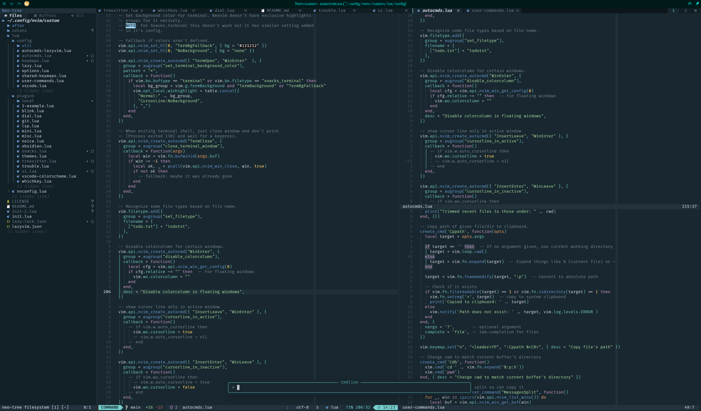

# My Neovim configuration

This is my Neovim configuration. It uses [Lazy.nvim](https://github.com/folke/lazy.nvim) as plugin manager. Many of the plugins and part of the plugin
configurations are from [LazyVim](https://www.lazyvim.org) which mentioned in comments. However, LazyVim isn't used as a distribution. 

## Features

Configurations for
- Key mappings
- Neovim options

Autocommands (code executed at certain events):
- Config files hot-reloading
- Custom terminal background color.
- Neovim CLI option to select session during startup.
- Dynamic window titles based on used config or session.
- Auto-close exiting terminal shells.
- Auto-open location list after search.
- Command mode path aliases.
- Change Obsidian.nvim vault automatically based on working directory.

User commands
- Clear oldfiles.
- Copy file path to clipboard.
- Trim trailing whitespace.
- Setting window title prefix.

Plugins:
- Plugins are lazy loaded if possible to keep startup speed <50ms.
Custom:
- Colorscheme based on NvChad/base46's Oceanic Next.
- Terminal colorsscheme using KDE Breeze theme colors.
- Dynamic terminal title for Yakuake terminal.
- Toggle window to center floating position.
Other:
- Lazy.nvim plugin manager.
- [folke/snacks.nvim: 🍿 A collection of QoL plugins for Neovim](https://github.com/folke/snacks.nvim)
- Picker: Snacks.picker
- [nvim-mini/mini.nvim: Library of 40+ independent Lua modules improving Neovim experience with minimal effort](https://github.com/nvim-mini/mini.nvim)
- UI: BufferLine, Lualine, Which-Key, Trouble, Noice, Nvim-web-devicons.
- LSP and completion: Nvim-lspconfig, Lazydev, Mason, Conform, Blink.
- Treesitter code parsing: nvim-treesitter, nvim-treesitter-textobjects, ts-comments.
- Git: Neogit, GitSigns, CodeDiff, Snacks.git
- File management: Neotree, Oil.
- Markdown: Markview, Markdown-Plus, Markdown-preview, Wrapwidth.
- [obsidian-nvim/obsidian.nvim: Obsidian 🤝 Neovim ](https://github.com/obsidian-nvim/obsidian.nvim)
- AI: Sidekick
- Various enhancements: Dial, Flash, Grug-FAR, inc-rename, Nvim-rip-substitute, Recover.vim, Vim-insert-append-single-character, Vim-Suda, ctrl-g.

- Compatible with VSCode when using VSCode Neovim -extension.

## File Structure

    nvim/
    ├── init.lua                      - Bootstrapping configuration.
    ├── after
    │   └── ftplugin                  - Filetype configs.
    │       ├── filetype1.lua
    │       └── **
    └── lua
        ├── config
        │   ├── util                  - Utility functions.
        │   ├── autocmds.lua          - Custom autocommands.
        │   ├── autocmds-lazyvim.lua  - LazyVim autocommands.
        │   ├── keymaps.lua           - Key mappings for this config.
        │   ├── shared-keymaps.lua    - Key mappings shared between different Neovim configs.
        │   ├── lazy.lua              - Lazy.nvim plugin manager settings.
        │   ├── options.lua           - Neovim options.
        │   ├── commands.lua          - User commands used in command mode.
        │   └── vscode.lua            - Settings used only when running embedded to VSCode.
        └── plugins                   
            ├── local                 - Local custom plugins.
            │   ├── neoceanic/        - Custom colorscheme.
            │   ├── **
            │   ├── spec2.lua
            ├── spec1.lua             - Lazy.nvim plugin specifications.
            ├── **
            └── spec2.lua

 ## Requirements

    Neovim >= 0.11.2 (needs to be built with LuaJIT)
    Git >= 2.19.0 (for partial clones support)
    a Nerd Font(v3.0 or greater) (optional, but needed to display some icons)
    tree-sitter-cli and a C compiler for nvim-treesitter.
    curl for blink.cmp (completion engine)
    live grep: ripgrep
    find files: fd
    a terminal or Neovim GUI that support true color and undercurl:
        Neovide
        Konsole / Yakuake ≥ 22.04 (Linux)
        kitty (Linux & Macos)
        alacritty, wezterm, ghostty (Linux, Macos & Windows)
        iterm2 (Macos)

## License

This configuration is a combination of:
- code derived from the LazyVim project
- my own original configuration

### LazyVim-derived parts

Portions of configurations are based on the LazyVim project, which is licensed under the Apache License 2.0. 
Copyright © LazyVim contributors

Those parts remain licensed under the Apache License, Version 2.0.
See the LICENSE file or https://www.apache.org/licenses/LICENSE-2.0 for details.

### My own configuration

All other parts of this repository that are not derived from LazyVim are released into the public domain. You may use, modify, and redistribute them without restriction.
